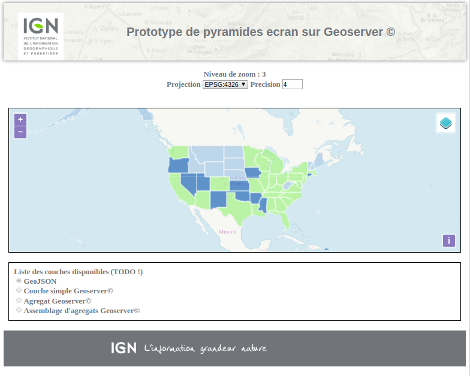

# prototype de client

creer un prototype d'utilisation du vecteur tuilé sur Geoserver© : interface cliente.

## HOWTO

* installation

> npm install

* execution

> npm run serve

Puis ouvrir le navigateur sur l'URL suivante :
> http://localhost:9999

* choix des couches à afficher
cf. data/config.json pour avoir la liste des couches mises à dispositions

## openlayers

Use Mapbox Style objects with OpenLayers
https://github.com/boundlessgeo/ol-mapbox-style

## styles & ol-mapbox-styles

Specification Styles MapBox
https://www.mapbox.com/mapbox-gl-js/style-spec/

styles editor type mapbox
- https://github.com/go-spatial/fresco
- https://fresco.netlify.com/

## TODO : themes

## TODO : layers & metadata

## TODO : customisation des styles par l'utilisateur

## TODO : filtre attributaire
